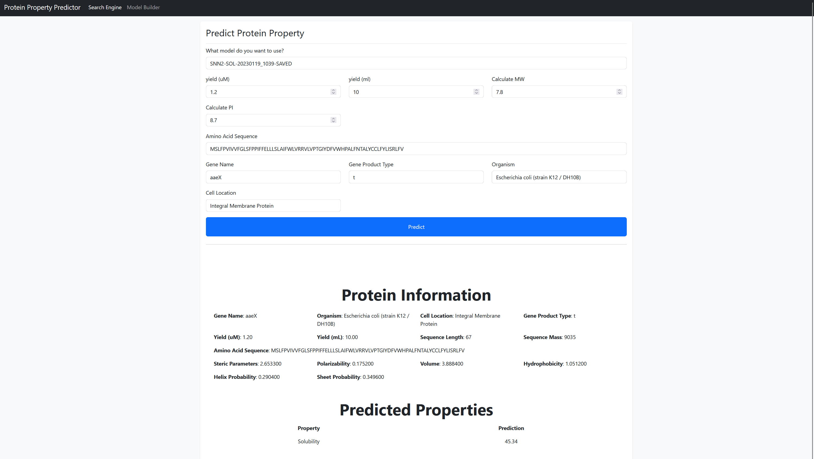

<br/>
<p align="center">
  <a href="https://github.com/nscharrenberg/EatingInsects">
    
  </a>

  <h3 align="center">Protein Property Prediction</h3>

  <p align="center">
    An application that uses machine learning techniques to make a predictions on certain properties such as Solubility.
    <br/>
    <br/>
    <a href="https://github.com/nscharrenberg/EatingInsects"><strong>Explore the docs »</strong></a>
    <br/>
    <br/>
    <a href="https://github.com/nscharrenberg/EatingInsects">View Demo</a>
    .
    <a href="https://github.com/nscharrenberg/EatingInsects/issues">Report Bug</a>
    .
    <a href="https://github.com/nscharrenberg/EatingInsects/issues">Request Feature</a>
  </p>
</p>

  

## Table Of Contents

* [About the Project](#about-the-project)
* [Built With](#built-with)
* [Getting Started](#getting-started)
  * [Prerequisites](#prerequisites)
  * [Installation](#installation)
* [Roadmap](#roadmap)
* [Contributing](#contributing)
* [Authors](#authors)
* [Acknowledgements](#acknowledgements)

## About The Project



The food-processing industry utilizes a variety of (artificial) additives to improve the preservation, taste, texture, and cosmetics of food-based products, among other reasons. Throughout the past decade, various studies have shown that the additives used within processed foods may contain potentially harmful proteins for human consumption 

In recent years, there has been an increased interest in using better, safer, and more sustainable sources of food additives, ingredients, and other materials.

The manual process of performing said research is a time-and resource consuming process. In an attempt to minimize the process, various institutes have spent research on the prediction of protein-based elements and the creation of various databases.

Previous research has mainly focused on predicting protein structures (Alphafold), protein alignments (PSI-BLAST), secondary structures (SPIDER3 and ProteinUnet), protein alignments with respect to locations (HH-Suit3) and tertiary protein structure prediction (SPOT-Contact).

On the other hand, effort and resources have been spent on preserving knowledge about proteins by the uniprot consortium and host institutes (EMBL-EBI, SIB and PIR) through the development of UniProt.

Most of these researches do not aim at providing information regarding behavioral similarities such as a specific property similarity. Different approaches have been researched to establish this aim, including graph machine learning (graphSol). Others only researched these properties on e.coli (eSOL).

Unfortunately, eSOL only aims at predicting ecoli bacteria, while graphSol utilizes state-of-the-art feature techniques such as PSI-BLAST, SPIDER3, and more to establish similar proteins, which is an extremely time-and resource-consuming approach, although seemingly performing well.

This application tries to combine the previously performed research together with existing datasets to create the building blocks for protein property prediction through the use of different machine learning models to ultimately utilize them within an ensemble learning protocol. While providing an easy to use interface for non-technical personnel.

## Built With

The application makes use of various frameworks.

* [Django](https://www.djangoproject.com/)
* [Tensorflow](https://www.tensorflow.org/)
* [Scikit-learn](https://scikit-learn.org)
* [SQLite](https://www.sqlite.org/index.html)

## Getting Started

To get a local copy up and running follow these simple steps:

### Prerequisites

The development of this project is done in Python 3 with the use of PIP (package manager) and venv (virtual environment).

You can choose the install it manually through the terminal or use IDEs such as Pycharm to handle this installation process for you.

Install prerequisites through terminal:
1. [Install PIP](https://packaging.python.org/en/latest/guides/installing-using-pip-and-virtual-environments/)
2. [Install Venv](https://packaging.python.org/en/latest/guides/installing-using-pip-and-virtual-environments/)
3.  [Create the Virtual Environment](https://packaging.python.org/en/latest/guides/installing-using-pip-and-virtual-environments/)
4. [Activate the Virtual Environment](https://packaging.python.org/en/latest/guides/installing-using-pip-and-virtual-environments/)
5. [Install the dependencies through requirements.txt](https://packaging.python.org/en/latest/guides/installing-using-pip-and-virtual-environments/)

in Pycharm:
1. [Install Pycharm and Python](https://www.jetbrains.com/help/pycharm/python.html) 
2. [Install dependencies](https://www.jetbrains.com/help/pycharm/managing-dependencies.html)

### Installation

After having gone through the prerequisite steps, you can execute the following steps to get the application to work:

Terminal:
1. run "manage.py migrate app" to create a local database instance. (SQLite)
2. run "manage.py runserver" to start the webserver.

Pycharm:
1. In the top menu click on "Tools" and then "Task manage.py".  This will open a terminal.
2. Type "migrate app" and press enter to create a local database instance (SQLite)
3. On the top right click  the green play button to start the application.

If there is no green play button, click on the select next to it and add a new configuration. 
Make sure this configuration is set to "Django Server" with environmental variables set as: `PYTHONUNBUFFERED=1;DJANGO_SETTINGS_MODULE=EatingInsects.settings` and the rest should work fine for default settings.

Once the server is running you can go to "http://localhost:8000" in your browser to see the application. 
**Note:** 8000 may change depending on the port that is being used. In the terminal it should give you the correct link once the application is running.

## Development Information
### Machine Learning Models
The application makes use of the following machine learning models:
- Sequential Neural Network
- Random Forests
- Decision Tree
- Linear Regression

Details of these implementations can be found in the research paper.

### Datasets
#### Train & Test sets
A dataset example can be found in `resources/private/datasets/sibo_dataset_example.csv`.

The following columns are required to be present within these datasets:
- yield_um
- yield_ml
- calculated_mw
- calculated_pi
- sequence_length
- sequence_mass
- steric
- polarizability
- volume
- hydrophobicity
- helix
- sheet

It'll also require the prediction columns:
- solubility

Validations errors will be given when a user uploads a dataset that misses any of these fields.

### Adding a new Model
#### Building a machine learning model
New models can be added in a standardized way. This can be done as follows:
1. Create a new directory that is named after your model in `app/networks` e.g. `app/networks/DT`.
2. Create a python file inside the newly created directory with the same name. e.g. `app/networks/DT/dt.py`
3. Create a new class named after this file and extend it with `app.networks.shared.BaseNetwork.BaseNetwork`.
4. Override the `compile` method with your model logic and make sure the model is returned.

An example model looks as follows:
```python
from tensorflow import keras
from app.networks.shared.BaseNetwork import BaseNetwork

class SNN(BaseNetwork):
    def compile(self):
        if self.model:
            raise Exception("Model has already been compiled")

        self.model = keras.Sequential([
            keras.layers.Dense(64, activation='relu'),
            keras.layers.Dense(64, activation='relu'),
            keras.layers.Dense(1)
        ])

        self.model.compile(
            loss=keras.metrics.RootMeanSquaredError(name="RMSE"),
            optimizer=keras.optimizers.Adam(float(self.predictor.learning_rate)),
            metrics=[
                keras.metrics.MeanAbsoluteError(name="MAE")
            ]
        )

        return self.model
```
**Note**: The following methods can be overridden if needed: `train`, `test`, `predict`. An example of this can be seen in the `DT`
 model.

**Note**: In the case of using Tensorflow, the loss and metrics are defined within the model compilation and will be used for evaluation later-on.

#### Integrating it to the system
Now that we model is present, we need to couple it to the system. 
This can be done as follows:
1. In `app.business.predictors.load_network(...)` you must define the newly created model.
2. If needed the model specification needs to be added to `app.models.ModelType`.

Example of adding a new model to `load_network`:
```python
if predictor.model_type == ModelType.DT.value:
    return DT(predictor)
```

Example of a new a new type to `ModelType`:
```python
DT = "DT", 'Decision Tree'
```

### Extending the application (new models, functionality)
This is more dependent on the implementation, and thus won't be fully explained.
The main takeaways are the following:
- `app.forms` contain the form specifications that can be seen in the GUI.
- `app.business` contains all the core business logic of the application.
- `app.models` contains the model classes of the application.
- `app.migrations` contains the database migrations.
  - On a new install or when new migrations are added run `manage.py migrate app`
  - When changes are made to any of the classes in `app.models` that may change the database structure, new migrations must be generated. This can easily be done by calling `manage.py makemigrations app`. After that make sure to migrate again (see above statement).
- `app.networks` contain all the machine learning models and their shared compounds.
- `app.static` contain files that won't change throughout runtime. Mainly css, js and static images.
- `app.template` contain the HTML code of all the GUI.
- `app.views` contain the frontend logic of all the GUI.

Django makes use of an MVT structure (Model-View-Template), which is similar to MVC (Model-View-Controller). The View is practically the Controller, while the Template is the View.

### Dynamic Data
As we're working with datasets and models that can be uploaded and created, we've some dynamic media pipeline in place.

- The database can be found in `db.sqlite3` and is a local in-memory database. Read the [django documentation on databases](https://docs.djangoproject.com/en/4.1/ref/databases/) in case you want to change to a proper database.
- When a user creates a new model and uploads a dataset this dataset will be stored in `resources/public/datasets` 
- When a user trains a new model this model will be stored in `resources/public/networks` when it completed training.

Personal data is not stored in any of the databases and as we're working with proteins, should not be included in the datasets either.

## Future Work
### Application Specific
- Dynamic Datasts and protein fields
- Dynamic machine learning model parameter fields
- Calculate PI and MW from amino acid sequence
- Compare model evaluations side-by-side or in visualized graphs

### Research Specific
- Synthetic data generation or manually retrieve more data
- Predict different kinds of protein properties (instead of just solubility)
- Protein Alignments and Similarities based on predicted property values (and maybe amino acid sequence)
- Distinguish between beneficial and harmful proteins for recommendation

### Machine Learning Models
- Graph Machine Learning (GraphSol)
- Ensemble Learning Model

## Contributing

Contributions are what make the open source community such an amazing place to be learn, inspire, and create. Any contributions you make are **greatly appreciated**.
* If you have suggestions for adding or removing projects, feel free to [open an issue](https://github.com/nscharrenberg/EatingInsects/issues/new) to discuss it, or directly create a pull request after you edit the *README.md* file with necessary changes.
* Please make sure you check your spelling and grammar.
* Create individual PR for each suggestion.
* Please also read through the [Code Of Conduct](https://github.com/nscharrenberg/EatingInsects/blob/main/CODE_OF_CONDUCT.md) before posting your first idea as well.

### Creating A Pull Request

1. Create your Feature Branch (`git checkout -b feature/AmazingFeature`)
2. Commit your Changes (`git commit -m 'Add some AmazingFeature'`)
3. Push to the Branch (`git push origin feature/AmazingFeature`)
4. Open a Pull Request

## Authors

* **Noah Scharrenberg** - *Bsc DSAI Student & Software Engineer* - [Noah Scharrenberg](https://github.com/nscharrenberg) - *Project Lead*
* **Bunyamin Thijssen** - *Bsc DSAI Student * - [Bunyamin Thijssen]() - *Research & Developer*
* **Claudia Sanchez** - *Bsc DSAI Student* - [Claudia Sanchez](https://github.com/clausanchezm) - *Research & Developer*
* **Parand Mohri** - *Bsc DSAI Student* - [Parand Mohri](https://github.com/Parand-Mohri) - *Research & Developer*
* **Mohammad Fayazi** - *Bsc DSAI Student* - [Mohammad Fayazi](https://github.com/MohammadFayazi) - *Research & Developer*
* **Laurence Manoukian** - *Bsc DSAI Student* - [Laurence Manoukian](https://github.com/Lorik1999) - *Research & Developer*

## Acknowledgements

* [Katharina Schneider]()
* [Ammar Ammar]()
* [eSol](http://www.tanpaku.org/tp-esol/download.php?lang=en)
* [GraphSol](https://github.com/jcchan23/GraphSol)
* [Pandas](https://pandas.pydata.org/)
* [xmltodict](https://pypi.org/project/xmltodict/)
* [Numpy](https://numpy.org/)
* [Sibo](https://sibo.tech)
